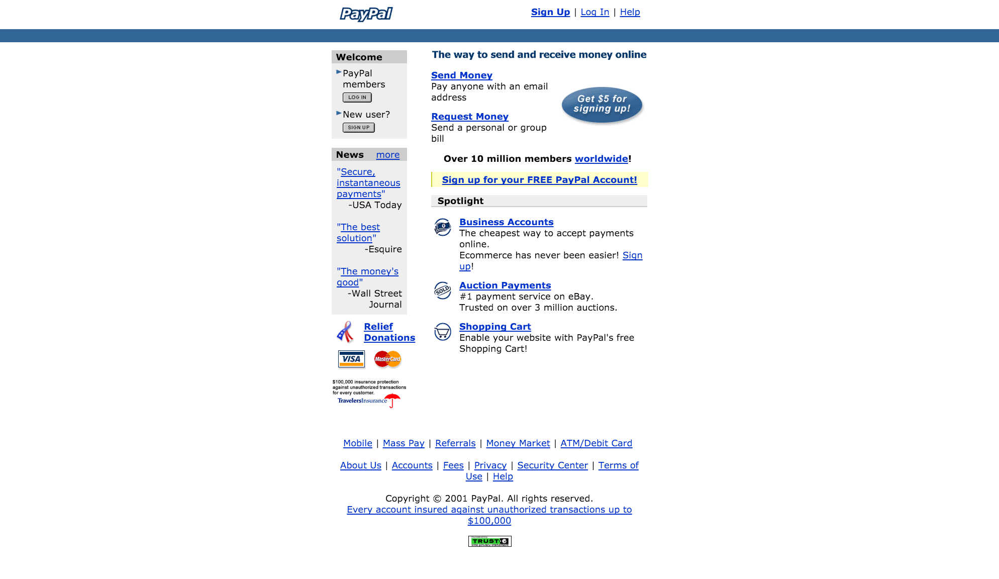

## Front End Challenge: PayPal

What follows below is an actual Front End Challenge from a previous class. Please read the instructions carefully, and solve this Challenge as a way to practice - don't be nervous if you cannot finish in under 4 hours, you will be able to solve these challenges faster and faster the more your practice.

***
**Front End Challenge**

**One** rule: do **not** get external help from other students/friends/human beings. You **are** allowed to use all your notes, this very website, the big almighty Internet, your previous assignments.

**Submit all your files**  **assignment@livecoding.nl with**  _[YOUR NAME] Front End Challenge_ **as the subject.**

You have to submit your **HTML and CSS** files. Add any **images** you have used. Ideally you **send one compressed (zip) file**. To make things easier we added some of the images in this repository called **[images.zip](./images.zip)**. You are free to screen shot the webpage and use your own images.

Please make sure you follow the **guidelines**:

* Indent your code
* Validate your HTML
* Write clear IDs and Classes
* Replicate the image below using HTML and CSS

Happy coding!

***
It's 2001 and your friend Craig is in love with the website you have created for him. He introduces you to a buddy of his, Elon, who wants to disrupt the banking industry through his startup - PayPal. Elon is a visionary in many fields, maybe not web design, since he has sent you the picture below that he designed himself. Anyway, you feel that this could be a cool project so you decide to work on it.

You just received the following e-mail from him, with **the instructions**:

> **From**: Elon Musk (elon@paypal.com) 
**Subject**: [URGENT] We need a website 
Hey, we have a ~~problem~~ opportunity in front of us. 
I'm meeting this guy from Sequoia Capital in like **4 hours** and I really need to show him at least the front end of our website. I know this is kind of short notice, but literally there's millions of dollars on the table that we might miss without a demo. You would be my hero nif you can finish this up by the time I get there. I attached the design below. Elon!

***
