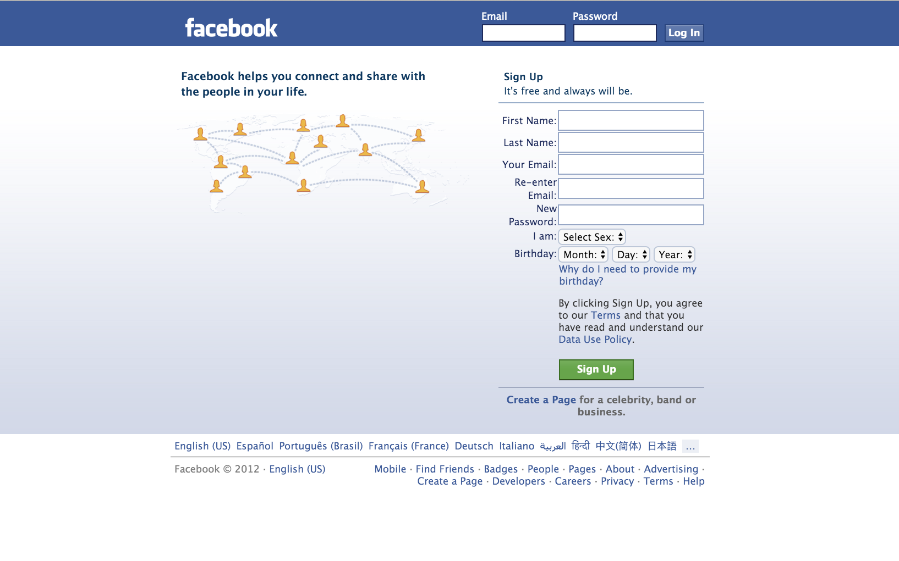

## The Facebook

**Front End Challenge**

**One rule:** Do not get external help from other students/friends/human beings. You are allowed to use all your notes, this very website, the big almighty Internet, your previous assignments.

You have to submit your HTML and CSS files. Add any images you have used. To make things easier we added some of the images at the bottom of the page. You are free to screen shot the webpage and use your own images.

When you are done, please compress all your files and upload it to the Trello board.

Please make sure you follow the guidelines:

* Indent your code
* Validate your HTML
* Write clear IDs and Classes
* Replicate the image below using HTML and CSS

Happy coding!

***

It's 2004 and this guy Mark just messaged you about a website very similar to My Space. You don't have anything to do in the next 4 hours so you decide to help him out, he seems fun.

You just received the following e-mail from him, with the instructions:

> **From**: Mark Zuckerberg (mark@facebook.com) 
>**Subject**: [URGENT] Login is Down 
>Hey, can you make me a quick login page like the example below? I don't know how the files got deleted and my whole website does not have a login page anymore. I'll give you some shares or something.   Mark 

##### Download Images
[images.zip](./images.zip)
